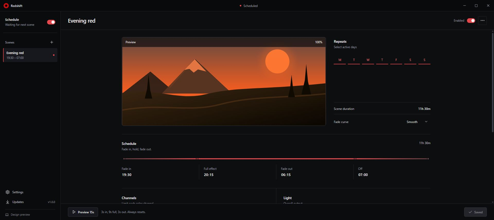
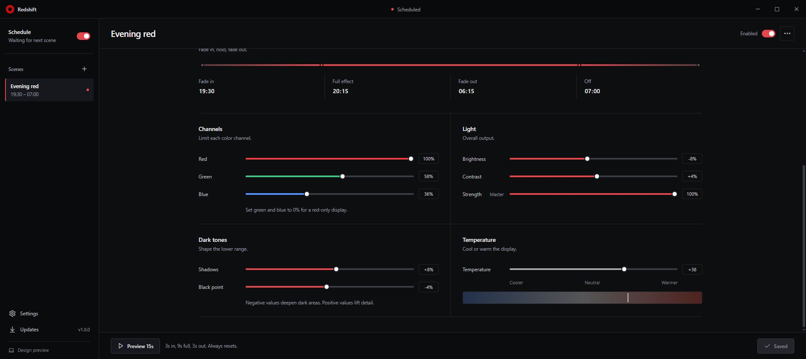

<p align="center">
  
</p>

<h1 align="center">Redshift</h1>

<p align="center">
  Schedule screen color profiles with gradual transitions on Windows, macOS, and Android.
</p>

<p align="center">
  <a href="https://github.com/MusicMaster4/Redshift/actions/workflows/ci.yml"></a>
  <a href="https://github.com/MusicMaster4/Redshift/releases/latest"></a>
  <a href="./LICENSE"></a>
</p>

Redshift changes the display according to four clock times: fade in, full effect, fade out, and off. Each scene has its own days, RGB channel limits, brightness, contrast, shadow detail, black point, temperature, and overall strength.

Closing the window does not stop the schedule. The desktop engine starts quietly after sign-in, stays in the tray, and creates the Tauri window only when you open it. If the computer sleeps during a transition, Redshift reads the current clock when it wakes and applies the point where the fade should be now.

<p align="center">
  
</p>

## Download

| Channel | Windows | macOS | Android |
| --- | --- | --- | --- |
| Stable (`main`) | [Installer](https://github.com/MusicMaster4/Redshift/releases/latest/download/redshift-setup.exe) | [DMG](https://github.com/MusicMaster4/Redshift/releases/latest/download/redshift.dmg) | [APK](https://github.com/MusicMaster4/Redshift/releases/latest/download/redshift.apk) |
| Beta (`testing`) | [Installer](https://github.com/MusicMaster4/Redshift/releases/download/channel-testing/redshift-beta-setup.exe) | [DMG](https://github.com/MusicMaster4/Redshift/releases/download/channel-testing/redshift-beta.dmg) | [APK](https://github.com/MusicMaster4/Redshift/releases/download/channel-testing/redshift-beta.apk) |

Stable installations only read the stable feed. Beta installations only read the beta feed. A release from one branch cannot replace an installation from the other channel.

## Scheduling

| Point | What happens |
| --- | --- |
| Fade in | The effect rises smoothly from the original display state. |
| Full effect | The chosen profile reaches its configured strength. |
| Fade out | The profile begins returning to the original display state. |
| Off | The original display state is restored. |

Schedules may cross midnight and can repeat on any combination of weekdays. Overlapping scenes are resolved by effective strength. The 15-second preview always uses a 3-second fade in, 9 seconds at full strength, and a 3-second fade out before restoring the display.

<p align="center">
  
</p>

## Platform behavior

| Platform | Display method | Background behavior |
| --- | --- | --- |
| Windows | Per-display gamma ramps, with the Windows full-screen color matrix as a driver fallback. | Native tray process launched with `--hidden`. No WebView is created until the window is opened. |
| macOS | Per-display CoreGraphics transfer tables. | LaunchAgent starts the native engine after sign-in. |
| Android | Non-interactive tint and dimming overlay. | Foreground service with a persistent low-priority notification; restored after boot when the schedule is enabled. |

Regular Android apps cannot remove individual physical RGB channels across the system. The mobile version therefore offers a tint mix, darkness, temperature, and strength through an overlay. Android asks for permission to display over other apps before enabling the schedule.

## Updates and release branches

- `main` publishes stable versions such as `v1.0.0` and owns GitHub's latest release.
- `testing` publishes prereleases such as `v1.0.1-testing.1` and refreshes the permanent `channel-testing` feed.
- Desktop update artifacts are signed with the Tauri updater key.
- Android updates verify the APK checksum before opening Android's installer. Android also enforces the app signing certificate when replacing an installed version.

The release workflow builds Windows x64, a universal macOS app for Intel and Apple silicon, and a signed Android APK. Apple notarization and Windows Authenticode require their respective developer certificates. Without those optional secrets, the files still build, but Gatekeeper or SmartScreen may show an unverified-publisher warning.

## Build from source

Desktop requirements:

- [Bun](https://bun.sh/)
- Rust 1.88 or newer
- The platform prerequisites from the [Tauri setup guide](https://v2.tauri.app/start/prerequisites/)

```sh
bun install
bun run app
```

Create a desktop installer with:

```sh
bun run app:build
```

Android requires JDK 17 and Android SDK 36. The Gradle wrapper is committed to the repository:

```sh
./android/gradlew -p android :app:testDebugUnitTest :app:assembleDebug
```

On Windows, run `android\gradlew.bat` instead.

## Checks

```sh
bun run typecheck
bun test
cargo test --locked --manifest-path src-tauri/Cargo.toml
```

CI repeats these checks on Windows, macOS, Ubuntu, and Android before a release is assembled.

## Privacy

Schedules and display settings stay on the device. Redshift has no account, analytics, advertisements, or telemetry. Network access is used only when you ask the app to check for an update.

## License

[MIT](./LICENSE)
